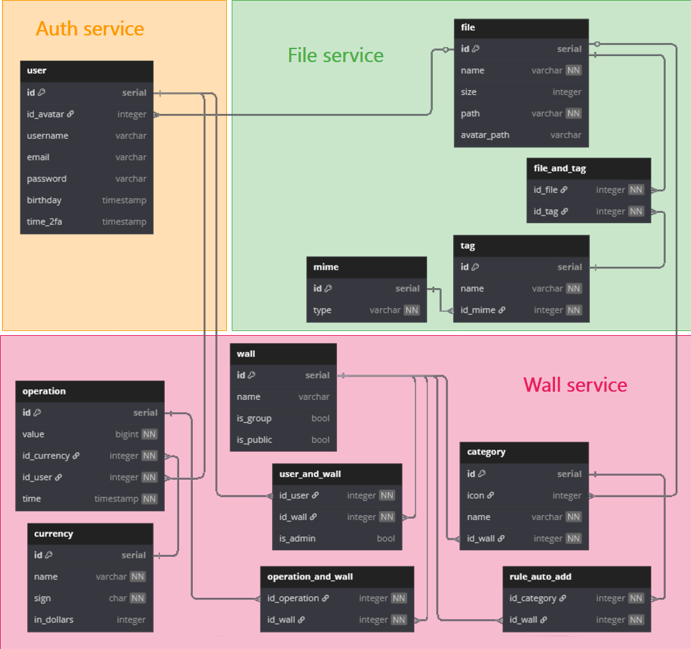

# Схема базы данных по сервисам 

> [!WARNING]
> Изменения БД и документации не синхронизировано, оперативные обновления смотрите на [dbdiagram.io](https://dbdiagram.io/d/loGMa-681611831ca52373f54f1348)

## Auth service 

### user

- **id** 
- **id_avatar** - id изображения в таблице file
- **username** - ник пользователя 
- **email** - почта пользователя
- **password** - пароль в MD5
- **birthday** - дата рождения пользователя
- **time_2fa** - время включения 2fa (необходимо для генерации ключа). Если указан 1970 год по UNIX time - считать, что авторизация по 2fa выключена  

## File service

### file

- **id**
- **name** - имя файла, данное пользователем 
- **size** - размер файла, в байтах
- **path** - путь в локальном хранилище к файлу
- **avatar_path** - путь к иконке (или уменьшенной копии в случаи изображения) в локальном хранилище

### file_and_tag

> Связующая таблица записей из file и tag

- **id_file**
- **id_tag**

### tag

- **id**
- **name** - имя тега (стандартно - расширение файла )
- **id_mime** - к какому mime типу приравнивать файл

### mime

- **id**
- **type** - <https://en.wikipedia.org/wiki/Media_type>

## Wall service

### wall

> Таблица стены пользователя или группы 

- **id**
- **name** - имя стены
- **is_group** - флаг, является ли стены групповой
- **is_public** - флаг, является ли стена доступной по прямой ссылке

### category

- **id**
- **icon** - id изображения в таблице file
- **name** - имя категории
- **id_wall** - id стены (wall), которой принадлежит категория

### rule_auto_add

> Таблица с правилами авто-добавления к конкретной стене, если добавлена конкретная категория 

- **id_category**
- **id_wall**

### user_and_wall

> Связующая таблица пользователей (user) со стеной (wall)

- **id_user**
- **id_wall**
- **is_admin** - флаг, является ли пользователь администратором в конкретной стене

### operation_and_wall

> Связующая таблица операций (operation) со стеной (wall)

- **id_operation**
- **id_wall**

### operation 

- **id** 
- **value** - количество денежных единиц в операции. Если число меньше 0 считается, что операция - трата, если больше 0 - то пополнение. Измерения идёт в копейках/центах/...
- **id_currency** - id валюты, в  которой совершена операция
- **id_user** - id пользователя, совершившего операция 
- **time** - время произведения операции

### currency 

- **id**
- **name** - название валюты
- **sign** - значок валюты в utf-8
- **id_dollars** - необязательный параметр конвертации валюты 

